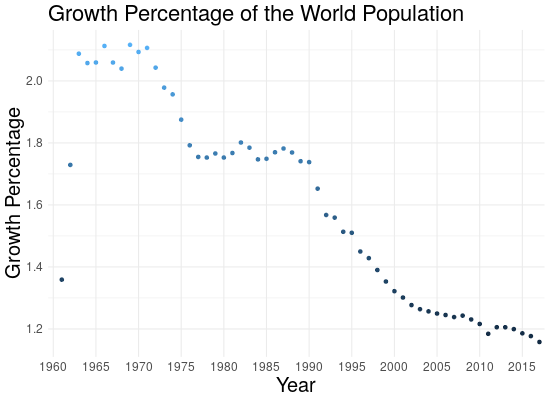
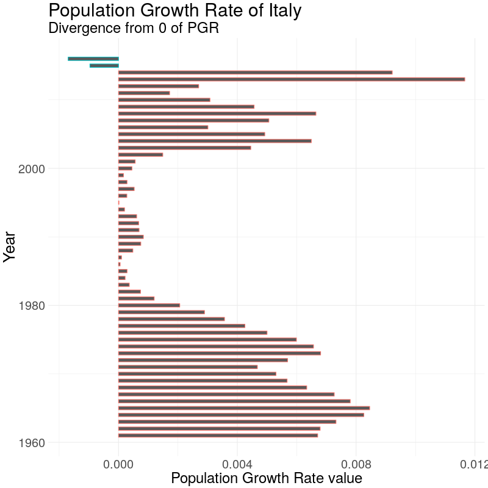

<style>
.column-left{
  float: left;
  width: 15%;
  text-align: left;
}
.column-right{
  float: right;
  width: 85%;
  text-align: center;
}
</style>


```{r setup, include=FALSE}
knitr::opts_chunk$set(echo = FALSE)
```

## Motivation

<figure>

</figure>


## World in the years




## Population distribution


## World Population Density Distribution

```{r, echo=FALSE}
htmltools::tags$iframe(title = "Map", src = "map.html")
```


## Demographic Transition

<font size="5">

* **Stage One**: pre-Industrial Revolution, birth rates and death rates are both high, the level of the population stays the same
* **Stage Two**: in a developing country death rates tents to diminish while birth rates stay high: population is growing
* **Stage Three**: thanks to the better economic and living conditions, births starts to decrease
* **Stage Four**: birth rates and death rates are both low, so population is stabilizing. Most of today's developed countries are in this stage
* **Stage Five** (possible stage): here the birth rates have fallen below death rates, so the quantity of older people is bigger than the quantity of younger ones

</font>

## Demographic Transition in Italy

```{r, echo=FALSE, message=FALSE}
library(tidyr)
library(plotly)
library(dplyr)
#setwd('/home/nicole/Data Science/exam_big_data')
birth_rate <- read.csv("Datasets/birth_rate.csv", skip=4)
death_rate <- read.csv("Datasets/death_rate.csv", skip=4)
tot_pop <- read.csv("Datasets/total_population.csv", skip=4)

dem_trans <- function(place) {
  birth_rate <- birth_rate %>%
    filter(Country.Name==place)
  death_rate <- death_rate %>%
    filter(Country.Name==place)
  tot_pop <- tot_pop %>%
    filter(Country.Name==place)
  
  colnames(birth_rate) <- c("Country", "Country.Code", "Indicator.Name", "Indicator.Code", substring(colnames(birth_rate[,6:length(birth_rate)-1]), 2), "X")
  colnames(death_rate) <- c("Country", "Country.Code", "Indicator.Name", "Indicator.Code", substring(colnames(death_rate[,6:length(death_rate)-1]), 2), "X")
  colnames(tot_pop) <- c("Country", "Country.Code", "Indicator.Name", "Indicator.Code", substring(colnames(tot_pop[,6:length(tot_pop)-1]), 2), "X")
  birth_rate[1:4] <- NULL; death_rate[1:4] <- NULL; tot_pop[1:4] <- NULL

  birth <- gather(birth_rate, key="year", "births", 1:ncol(birth_rate))
  death <- gather(death_rate, key="year", "deaths", 1:ncol(death_rate))
  pop <- gather(tot_pop, key="year", "quantity", 1:ncol(tot_pop))
  birth <- birth[-c(58,59),]
  death <- death[-c(58,59),]
  pop <- pop[-c(58,59),]
  #pop$quantity <- pop$quantity/10000000
  tmp <- left_join(birth, death, by="year")
  return(left_join(tmp, pop, by="year"))
}
place <- "Italy"
full <- dem_trans(place)

p1 <- plot_ly(full, x = ~year, y = ~births, name = 'Births', type = 'scatter', mode = 'lines+markers',width = 1050, height = 320) %>%
  add_trace(y = ~deaths, name = 'Deaths', mode = 'lines+markers') %>%
  layout(title = "Demoghraphic Transition",
         xaxis = list(title = "Year"),
         yaxis = list (title = paste("Deaths/Births (per 1000 people) in ",place)))

p2 <- plot_ly(full, x = ~year, y = ~quantity, name = 'Population', type = 'scatter', mode = 'lines+markers',width = 1050, height = 320) %>%
  layout(title = paste("Demoghraphic Transition of",place),
         xaxis = list(title = "Year"),
         yaxis = list (title = paste(place, "'s Total population")) )
         
p <- subplot(p1, p2, shareX = TRUE, titleX = TRUE, titleY = TRUE, margin = c(0.02,0.02,0.02,0.02))
p
```

## Demographic Transition in Italy

``````{r, echo=FALSE, message=FALSE}
tot_pop2 <- read.csv("Datasets/pop_italy_earlyages.csv")
tot_pop2$pop = tot_pop2$pop*1000

p3 <- plot_ly(tot_pop2, x = ~year, y = ~pop, name = 'population', type = 'scatter', mode = 'lines+markers',width = 1000, height = 400) %>%
  layout(title = "Population amount",
         xaxis = list(title = "Year\n <a href='http://www.populstat.info/Europe/italyc.htm'>Source of the Data </a>"),
         yaxis = list (title = paste("Total population of ",place)),
         margin = c(0.02,0.02,0.02,0.02),
         shapes = list(list(type = "rect",
                    fillcolor = "green", line = list(color = "green"), opacity = 0.4,
                    x0 = "1960", x1 = "2005", xref = "x",
                    y0 = 400, y1 = 60000000, yref = "y")) )
          
p3

```


## Population Growth Rate (PGR)
<div class="column-left">
<font size="4">
$$
PGR = \frac{P(t_2) - P(t_1)}{P(t_1)(t_2 - t_1)}
$$
</font>
</div>
<div class="column-right">
```{r, echo=FALSE,  out.width = '60%'}

```
</div>

## What are the Prospects?  

<figure>
<a href="http://overpop2013.weebly.com/uploads/1/7/2/9/17291870/497887430.jpg">

</a>
</figure>

<font size="4">

**Logistic model for Population Growth:**

$$
\frac{dN}{dt} = rN(1-\frac{N}{K})
$$
It can be integrated, obtaining:

$$
N(t) = \frac{K N_0 e^{-rt}}{K + N_0(e^{-rt}-1)}
$$

Where $N_0$ is the starting number of individuals.

</font>


## Logistic model for Population Growth

```{r}
pop <- read.csv("Datasets/total_population.csv", skip=4)
{
w <- pop %>%
  filter(Country.Name=="World")%>%
  select(-Country.Name, -Country.Code, -Indicator.Name, -Indicator.Code, -X)
colnames(w) <- c(substring(colnames(w[,1:length(w)]), 2))
colnames(w)
w[2,]<- colnames(w)
w <- data.frame(t(w))
colnames(w) <- c("world_pop", "year")

w$world_pop <- as.numeric(as.character(w$world_pop))
w$year <- as.numeric(as.character(w$year))
}

newdata <- seq(2018,2100)
newdata <- data.frame(newdata)
colnames(newdata)[1] <- "year"

# linear model
mod <- lm(world_pop ~ year, w)
lmod <- predict(mod, newdata)
newdata$lm <- data.frame(lmod)
#newdata <- newdata %>%
#  select(lm, year)


## LOGIT!! :)

mod <- nls(world_pop ~ SSlogis(year, phi1, phi2, phi3), data = w)
pred <- predict(mod, newdata)
#vv <- data.frame(pred)
newdata$world_pop <- data.frame(pred[1:83])
newdata <- newdata %>%
  select(world_pop, year, -lm)
newdata$world_pop <- as.numeric(unlist(newdata$world_pop))
tot <- rbind(w, newdata)

p1 <- plot_ly(tot, x = ~year, y = ~world_pop, name = 'popolation', type = 'scatter', mode = 'lines+markers', width = 1000, height = 500) %>%
  layout(title = "Predicted trend of world population growth until 2100",
         xaxis = list(title = "Year"),
         yaxis = list (title = paste("Population (Billions)")))
p1
```


## References and Data Sources

<font size="4">
[1] https://en.wikipedia.org/wiki/Toba_catastrophe_theory<br />
[2] https://www.kaggle.com/fernandol/countries-of-the-world<br />
[3] https://data.worldbank.org/<br />
[4] https://www.ecology.com/population-estimates-year-2050/ (early ages)<br />
[5] https://en.wikipedia.org/wiki/Demographic_transition<br />
[6] https://en.wikipedia.org/wiki/Logistic_function<br />
[7] https://en.wikipedia.org/wiki/Projections_of_population_growth<br />
[8] http://www.clker.com/clipart-530947.html (clipart)
</font>

