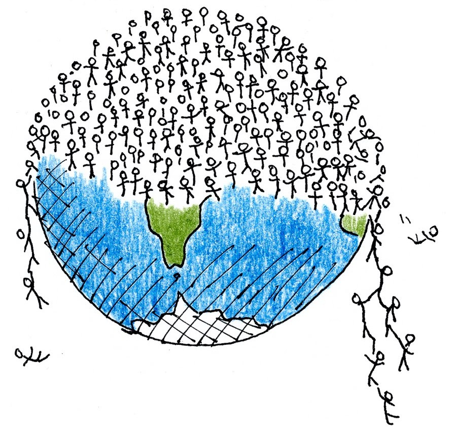
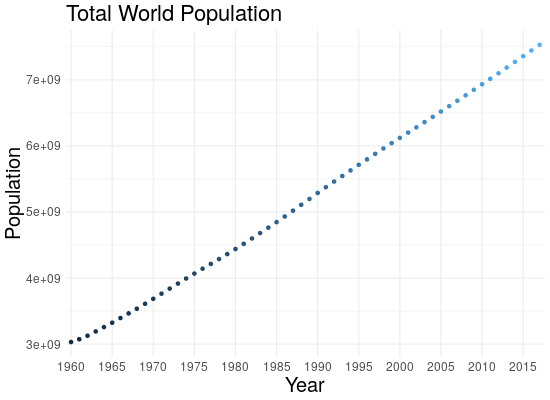
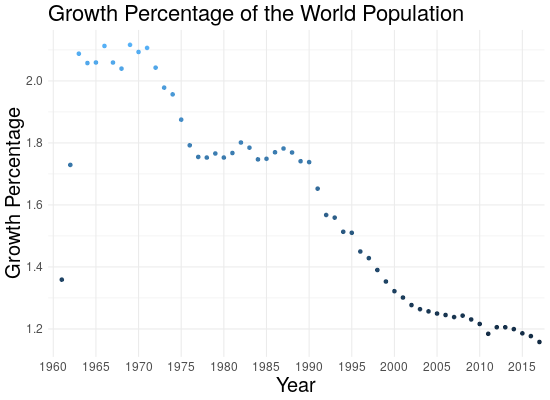
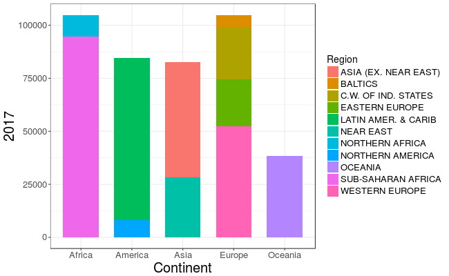
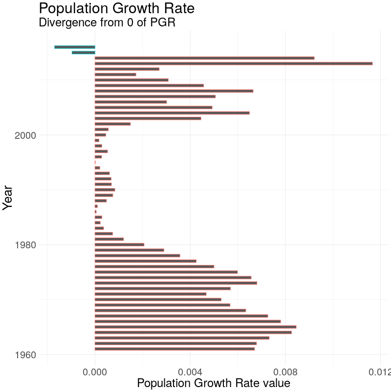
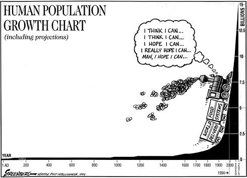

<style>
.footnote {
  position: absolute;
  bottom: 0;
  margin-bottom: 35px;
  width: 80%;
  font-size: 65%;
}
.content {
    height: 100%;
    width:1000px;
    margin: 10px 10px 10px 100px;
    top: 10px;
    background-color: #fff;
}
.text-left{
  float: left;
  text-align: left;
}
.column-left{
  float: left;
  width: 35%;
  text-align: left;
}
.column-left2{
  position: absolute;
  left: 0;
  margin-left: 10px;
  float: left;
  width: 60%;
  text-align: left;
}
.column-right{
  float: right;
  width: 65%;
  text-align: center;
}
.column-right2{
  float: right;
  width: 40%;
  height: 80%;
  text-align: center;
}
</style>


```{r setup, include=FALSE}
knitr::opts_chunk$set(echo = FALSE)
```

## Perche?

<figure>

</figure>

## Sorgenti Dati

<figure>

</figure>

<figure>

</figure>

<figure>

</figure>

<figure>

</figure>


## Stima della Popolazione Mondiale

<div class="content">

```{r, echo=FALSE, message=FALSE}
library(plotly)
library(readODS)
early_years <- read.ods("Datasets/world_early_ages.ods")
early_years <- data.frame(early_years)
early_years <- early_years[2:nrow(early_years),]
early_years[,1] <- as.integer(early_years[,1])
early_years[,2] <- as.integer(early_years[,2])
early_years[,3] <- as.integer(early_years[,3])
colnames(early_years) <- c("year","low","high")
early_years <- early_years %>%
  mutate(average = (low+high)/2)
 
p <- plot_ly(early_years, x = ~year, y = ~high, type = 'scatter', mode = 'linesandmarkers', width = 680, height = 500,
            marker=list( size=5 , opacity=0.2, color='rgb(0, 0, 102)'),
             line = list(color = 'rgb(180, 200, 250)'), 
             showlegend = FALSE, name = "Higher Estimate") %>%
  add_trace(y = ~low, type = 'scatter', mode = 'linesandmarkers', 
            marker=list( size=5 , opacity=0.2, color='rgb(0, 0, 102)'), 
            fill = 'tonexty', fillcolor='rgb(180, 200, 250)', 
            line = list(color='transparent'),
            showlegend = FALSE, name = "Lower Estimate") %>%
  add_trace(x = ~year, y = ~average, type = 'scatter', mode = 'linesandmarkers', 
            marker=list( size=5 , opacity=0.5, color='rgb(70,150,80)'),
            line = list(color='rgb(0,150,0)'),marker=list( size=5 , opacity=0.5, color="black"),
            name = '(Year, Avg)') %>%
  layout(title = "World Population Estimation\n (1 A.D - 1900 A.D)",
         paper_bgcolor='rgb(255,255,255)',
         xaxis = list(title = "Years",
                      #gridcolor = 'rgb(255,255,255)',
                      showgrid = TRUE,
                      showline = FALSE,
                      showticklabels = TRUE,
                      tickcolor = 'rgb(127,127,127)',
                      ticks = 'outside',
                      zeroline = FALSE),
         yaxis = list(title = "World Population (in millions)",
                      #gridcolor = 'rgb(255,255,255)',
                      showgrid = TRUE,
                      showline = FALSE,
                      showticklabels = TRUE,
                      tickcolor = 'rgb(127,127,127)',
                      ticks = 'outside',
                      zeroline = FALSE))
p
```

</div>


## Il Mondo negli Anni




## Distribuzione della Popolazione

<div class="column-left2">

```{r, echo-FALSE}
#<div class="content">
#content>
```



</div>
<div class="column-right2">
```{r, echo=FALSE}
htmltools::tags$iframe(title = "Map", src = "map_Regions.html")
```
</div>

## Distribuzione della Densità di Popolazione

```{r, echo=FALSE}
htmltools::tags$iframe(title = "Map", src = "map.html")
```


## Modello di Transizione Demografica

<font size="5">

Warren Thompson, 1929

* **<span style="color:green">Stage 1</span>**: Pre Rivoluzione industriale, alti rate di natalità e mortalità
* **<span style="color:green">Stage 2</span>**: Il paese di sta sviluppando, la mortalità diminuisce mentre i tassi di natalità rimangono alti: la popolazione aumenta
* **<span style="color:green">Stage 3</span>**: I rate di nascita iniziano a diminuire, grazie alle migliori condizioni di vita, economiche ed igieniche
* **<span style="color:green">Stage 4</span>**: I tassi di natalità e mortalità sono entrambi bassi, la popolazione si stabilizza
* **<span style="color:green">Stage 5</span>** (stage possibile): I rate di nascite cadono al di sotto dei rate di morti, la popolazione invecchia

</font>

## Transizione Demografica in Italia

```{r, echo=FALSE, message=FALSE}
library(tidyr)
library(plotly)
library(dplyr)
#setwd('/home/nicole/Data Science/exam_big_data')
birth_rate <- read.csv("Datasets/birth_rate.csv", skip=4)
death_rate <- read.csv("Datasets/death_rate.csv", skip=4)
tot_pop <- read.csv("Datasets/total_population.csv", skip=4)

dem_trans <- function(place) {
  birth_rate <- birth_rate %>%
    filter(Country.Name==place)
  death_rate <- death_rate %>%
    filter(Country.Name==place)
  tot_pop <- tot_pop %>%
    filter(Country.Name==place)
  
  colnames(birth_rate) <- c("Country", "Country.Code", "Indicator.Name", "Indicator.Code", substring(colnames(birth_rate[,6:length(birth_rate)-1]), 2), "X")
  colnames(death_rate) <- c("Country", "Country.Code", "Indicator.Name", "Indicator.Code", substring(colnames(death_rate[,6:length(death_rate)-1]), 2), "X")
  colnames(tot_pop) <- c("Country", "Country.Code", "Indicator.Name", "Indicator.Code", substring(colnames(tot_pop[,6:length(tot_pop)-1]), 2), "X")
  birth_rate[1:4] <- NULL; death_rate[1:4] <- NULL; tot_pop[1:4] <- NULL

  birth <- gather(birth_rate, key="year", "births", 1:ncol(birth_rate))
  death <- gather(death_rate, key="year", "deaths", 1:ncol(death_rate))
  pop <- gather(tot_pop, key="year", "quantity", 1:ncol(tot_pop))
  birth <- birth[-c(58,59),]
  death <- death[-c(58,59),]
  pop <- pop[-c(58,59),]
  #pop$quantity <- pop$quantity/10000000
  tmp <- left_join(birth, death, by="year")
  return(left_join(tmp, pop, by="year"))
}
place <- "Italy"
full <- dem_trans(place)

p1 <- plot_ly(full, x = ~year, y = ~births, name = 'Births', type = 'scatter', mode = 'lines+markers',width = 1050, height = 320) %>%
  add_trace(y = ~deaths, name = 'Deaths', mode = 'lines+markers') %>%
  layout(title = "Demoghraphic Transition",
         xaxis = list(title = "Year"),
         yaxis = list (title = paste("Deaths/Births (per 1000 people) in ",place)))

p2 <- plot_ly(full, x = ~year, y = ~quantity, name = 'Population', type = 'scatter', mode = 'lines+markers',width = 1050, height = 320) %>%
  layout(title = paste("Demoghraphic Transition of",place),
         xaxis = list(title = "Year"),
         yaxis = list (title = paste(place, "'s Total population")) )
         
p <- subplot(p1, p2, shareX = TRUE, titleX = TRUE, titleY = TRUE, margin = c(0.02,0.02,0.02,0.02))
p
```

<font size="5">

Tassi di Natalità e Mortalità:
$$
n(x) = \frac{N(x)}{(P(x-1) + P(x))/2} \cdot 100
$$
</font>

## Transizione Demografica in Italia

``````{r, echo=FALSE, message=FALSE}
tot_pop2 <- read.csv("Datasets/pop_italy_earlyages.csv")
tot_pop2$pop = tot_pop2$pop*1000

p3 <- plot_ly(tot_pop2, x = ~year, y = ~pop, name = 'population', type = 'scatter', mode = 'lines+markers',width = 1000, height = 400) %>%
  layout(title = "Population amount",
         xaxis = list(title = "Year\n <a href='http://www.populstat.info/Europe/italyc.htm'>Source of the Data </a>"),
         yaxis = list (title = paste("Total population of ",place)),
         margin = c(0.02,0.02,0.02,0.02),
         shapes = list(list(type = "rect",
                    fillcolor = "green", line = list(color = "green"), opacity = 0.4,
                    x0 = "1960", x1 = "2005", xref = "x",
                    y0 = 400, y1 = 60000000, yref = "y")) )
          
p3

```


## Population Growth Rate (PGR)

<div class="column-left">
<font size="4">

Il PGR misura il rate al quale il numero di individui varia in un dato periodo di tempo:
<br /><br />

$$
PGR = \frac{P(t_2) - P(t_1)}{P(t_1)(t_2 - t_1)}
$$
</font>
</div>
<div class="column-right">


```{r, echo=FALSE,  out.width = '78%'}

```
</div>

## Quali sono le Previsioni? 

<figure>
<a href="http://overpop2013.weebly.com/uploads/1/7/2/9/17291870/497887430.jpg">

</a>
</figure>
<div class="text-left">

<font size="5">
Quanti saremo nel 2100?
<br /><br />
</font>

<font size="4">


**Modello Logistico per la Crescita della Popolazione:**

$$
\frac{dN}{dt} = rN(1-\frac{N}{K})
$$
Integrando:

$$
N(t) = \frac{K N_0 e^{-rt}}{K + N_0(e^{-rt}-1)}
$$

Dove:

* $N_0$ è il numero di individui iniziale
* r è il rate di crescita
* K è la capacità portante dell'ambiente

</font>
</div>


## Modello Logistico

```{r}
pop <- read.csv("Datasets/total_population.csv", skip=4)
{
w <- pop %>%
  filter(Country.Name=="World")%>%
  select(-Country.Name, -Country.Code, -Indicator.Name, -Indicator.Code, -X)
colnames(w) <- c(substring(colnames(w[,1:length(w)]), 2))
colnames(w)
w[2,]<- colnames(w)
w <- data.frame(t(w))
colnames(w) <- c("world_pop", "year")

w$world_pop <- as.numeric(as.character(w$world_pop))
w$year <- as.numeric(as.character(w$year))
}

newdata <- seq(2018,2100)
newdata <- data.frame(newdata)
colnames(newdata)[1] <- "year"

# linear model
mod <- lm(world_pop ~ year, w)
lmod <- predict(mod, newdata)
newdata$lm <- data.frame(lmod)
#newdata <- newdata %>%
#  select(lm, year)


## LOGIT!! :)

mod <- nls(world_pop ~ SSlogis(year, phi1, phi2, phi3), data = w)
pred <- predict(mod, newdata)
#vv <- data.frame(pred)
newdata$world_pop <- data.frame(pred[1:83])
newdata <- newdata %>%
  select(world_pop, year, -lm)
newdata$world_pop <- as.numeric(unlist(newdata$world_pop))
tot <- rbind(w, newdata)

p1 <- plot_ly(tot, x = ~year, y = ~world_pop, name = 'popolation', type = 'scatter', mode = 'lines+markers', width = 1000, height = 500) %>%
  layout(title = "Predicted trend of world population growth until 2100",
         xaxis = list(title = "Year"),
         yaxis = list (title = paste("Population (Billions)")))
p1
```


## .


<figure>

</figure>

<figure>
<a href="https://data.worldbank.org/">

</a>
</figure>


## Riferimenti e Sorgenti Dati

<font size="4">
[1] https://en.wikipedia.org/wiki/Toba_catastrophe_theory<br />
[2] https://www.kaggle.com/fernandol/countries-of-the-world<br />
[3] https://data.worldbank.org/<br />
[4] https://www.ecology.com/population-estimates-year-2050/ (early ages)<br />
[5] https://en.wikipedia.org/wiki/Demographic_transition<br />
[6] https://en.wikipedia.org/wiki/Logistic_function<br />
[7] https://en.wikipedia.org/wiki/Projections_of_population_growth<br />
[8] http://www.clker.com/clipart-530947.html (clipart)
</font>


## Quante persone hanno vissuto sulla Terra?

```{r}
library(knitr)
c <- data.frame("Year" = c("8000 B.C", "1200" ,"1750", "1850", "1950", "2017"), 
                "Population" = c("5.000.000","450.000.000", "795.000.000","1.265.000.000","2.516.000.000","7.536.000.000"), 
                "Ever_Born_People" = c("1.137.789.769", "73.754.465.125", "89.708.399.091","93.754.639.100", "100.045.075.171", "108.470.690.115") )
kable(c)
```

<div class="footnote">
Data Source: https://www.prb.org/howmanypeoplehaveeverlivedonearth/
</div>

