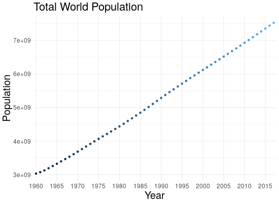
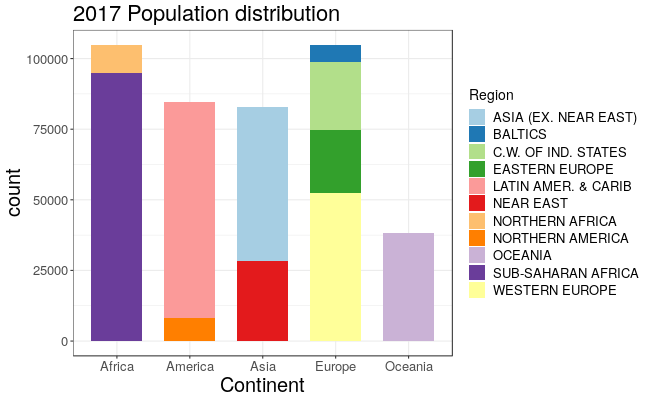
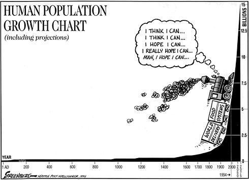

<style>
.column-left{
  float: left;
  width: 50%;
  text-align: left;
}
.column-right{
  float: right;
  width: 50%;
  text-align: center;
}
</style>
```{r setup, include=FALSE}
knitr::opts_chunk$set(echo = TRUE)
knitr::opts_chunk$set(eval = TRUE )
knitr::opts_chunk$set(cache = TRUE )
knitr::opts_chunk$set(warning = FALSE )
knitr::opts_chunk$set(message = FALSE )
```

<figure>
<a href="http://www.clker.com/clipart-530947.html">

</a>
</figure>

## Motivation

Never before in history, have there been so many people on Earth as right now. The number boosted in the years, from around 1 billion in the year 1800, to 7.5 billions in 2017.<br />

For what concerns the population amount at earlier times, some estimates have been done: at the time agriculture emerged in around 10.000 Before Christ, the world population ranged between 1 million and 15 million. Even earlier - about 70.000 years ago - studies supports that humans may have gone through bottleneck of 1000 - 10000 people according to the thory of the Toba supervulcanic eruption<a href="#tag">$^{[1]}$</a>.

So I asked myself, given the population growth of the last century, what should we expect for the next one? Will this lead to major changes in our lifestyle, or will this lead to wars, poverty problems, lack of primary resources and so on?<br />
Or maybe all those are just unwarrant fears and everything is going to fix itself?

## The Data


### Data Sources

For this study I joined various dataset. 

I started my analysis using some datasets I found on the World Bank Open Data at https://data.worldbank.org/, where I downloaded the collections of data regarding population amount, Birthrate and Deathrate (both normalized over 1.000 people) of a Country; those datasets contain values about the relative indicators from 1960 to 2016 for (quite) every Country in the world, and they show some missing data.<br />

To analyze the situation in Italy also in earlier years (1700 - 1960) I added the data found here: https://www.populstat.info/Europe/italyc.htm. <br />

To have an estimate of the world's population from year one AD (annus domini), I took also data from here: https://www.ecology.com/population-estimates-year-2050/. <br />

Finally, I used a bit also the dataset "Countries of the world" that you can find on Kaggle at https://www.kaggle.com/fernandol/countries-of-the-world, which contains some geographic charachteristics of the different countries, but of those I actually used only the Continent, the Region (which I will better define later), the Area and something else.


### Data Analysis

To analyze the data I made use of different R packages:  plotly, dplyr, leaflet, ggplot2, tidyr, readr and stringr are the main names, but I used also geojsonio, rworldmap and countrycode to parse the data, leaflet to create some plots, and htmlwidget and htmltools to save and plot some interactive maps.

Let's start now to explore a bit our datasets.

**Early Ages**

First of all, let's have a look to the first stages of the human growth, from year 1 A.D. to 1800 A.D.

```{r, echo=FALSE, message=FALSE}
library(plotly)
library(readODS)
early_years <- read.ods("Datasets/world_early_ages.ods")
early_years <- data.frame(early_years)
early_years <- early_years[2:nrow(early_years),]
early_years[,1] <- as.integer(early_years[,1])
early_years[,2] <- as.integer(early_years[,2])
early_years[,3] <- as.integer(early_years[,3])
colnames(early_years) <- c("year","low","high")
early_years <- early_years %>%
  mutate(average = (low+high)/2)
 
p <- plot_ly(early_years, x = ~year, y = ~high, type = 'scatter', mode = 'linesandmarkers', 
            marker=list( size=5 , opacity=0.2, color='rgb(0, 0, 102)'),
             line = list(color = 'rgb(180, 200, 250)'), 
             showlegend = FALSE, name = "Higher Estimate") %>%
  add_trace(y = ~low, type = 'scatter', mode = 'linesandmarkers', 
            marker=list( size=5 , opacity=0.2, color='rgb(0, 0, 102)'), 
            fill = 'tonexty', fillcolor='rgb(180, 200, 250)', 
            line = list(color='transparent'),
            showlegend = FALSE, name = "Lower Estimate") %>%
  add_trace(x = ~year, y = ~average, type = 'scatter', mode = 'linesandmarkers', 
            marker=list( size=5 , opacity=0.5, color='rgb(70,150,80)'),
            line = list(color='rgb(0,150,0)'),marker=list( size=5 , opacity=0.5, color="black"),
            name = '(Year, Avg)') %>%
  layout(title = "World Population Estimation of Early Ages\n (1 A.D - 1800 A.D)",
         paper_bgcolor='rgb(255,255,255)',
         xaxis = list(title = "Years",
                      #gridcolor = 'rgb(255,255,255)',
                      showgrid = TRUE,
                      showline = FALSE,
                      showticklabels = TRUE,
                      tickcolor = 'rgb(127,127,127)',
                      ticks = 'outside',
                      zeroline = FALSE),
         yaxis = list(title = "World Population (in millions)",
                      #gridcolor = 'rgb(255,255,255)',
                      showgrid = TRUE,
                      showline = FALSE,
                      showticklabels = TRUE,
                      tickcolor = 'rgb(127,127,127)',
                      ticks = 'outside',
                      zeroline = FALSE))
p
#
```

To generate this plot, I just had to read and plot a simple three-columns table. I decided to use plotly, to have an interactive view of the data.<br />
The table contains a lower estimate and the upper estimate of the world population in the years frame 1 - 1800 AD. As you can see, we started from year one with a mean value of 285 millions of individuals, number which then grew up to around 1.6 billions in 1800: in those ages, the world population starts to grow with a trend that seems exponential <br /><br />

**World Bank Data**

Let's take a look to the datasets of World Bank Open Data.<br />
When one decides to download an indicator from this site, ends up with three files: 

* The first one is made only by a source note, which better describes the choosen indicator: for "Total Population" we found : **Total population is based on the de facto definition of population, which counts all residents regardless of legal status or citizenship. The values shown are midyear estimates**;
* In the second one we found more precise descriptions for each Country;
* The third one is the real dataset, which contains the following columns:
    * "Country Name"  
    * "Country Code"   
    * "Indicator Name" 
    * "Indicator Code"
    * years from 1960 to 2017

Indicator Name and Code are quite useless for our scope, beacuse they are only a skimpy description of the table content. Country name and code are instead essential: each observation (row) of the table contains all the data values for one single Country, for the 1960 - 2017 time frame.

We can say that those data frames are tidy: the primary key is obviously present (the Country name, but also the Code can be used), each observations has its own row, and each variable is set in only one column, if we consider each year as a variable on its own. In some of my later use, however, "Years" will become a variable, and I will have to use the **gather** function to modify my dataset. <br />
The only thing I had to do to "tidy" my data, was to eliminate some rows or columns which contained only NA values.<br /> 
An important thing to say, is that this dataset contains also some non-Country data, inserted as rows into the dataset: as an example, there is the row "World". It was not necessary to eliminate them, but it was needed to be aware they were present.

I decided at this point to add to each Country the "Continent" and "Region" variables (the last one indicates the part of the Continent in which the Country is located), to chech the trend of the selected indicators as a dependence of those. To do this I had to modify the dataset adding some column by means of dlpyr and the mutate command.<br /> 
This analysis done here above were made for all the dataset downloaded from the world bank, and can be found in the first part of the "world.R" script file.
<br /><br />

**Population Growth Trend**

So, first big question: what is the trend of the world population growth in these last years? I decided to plot it, but to have a deeper understanding of the growth process, I had a look also at the Percentage of growth for every year, computed as:

$$
GrowthPercentage = \frac{P_{t}-P_{t-1}}{P_{t}} \cdot 100
$$

Where $P_{t}$ represents the population in a certain year and $P_{t-1}$ the population in the preceeding year.

{ width=49% } { width=49% }

So, the population is still growing, but the growth rate is falling down quickly, it seems: it went from around 2.0% to 1.0% within 57 years! This is a good news to hear, as the fear of the overpopulation is present in those years.
<br /><br />

**Population Distribution**

To complete our understanding, let's now have a look at the distribution of the people around the Continents and the different Regions in 2017. I made a check in different years, but the distribution (normalized over the number of people) is always quite the same, so I report here plot only for the year 2017.
<br />

{ width=75% ref="refe"}

<br />

Looking to the distribution plot, we can see that the most populous areas are the Sub-Saharan Africa and the Latin America and Carribean.

Given the "total population" data, I created a new dataset containing the density of people in the different Countries, to show it then on a map: to do so I keep the "Area" measure from the "countries_world" dataset (took from Kaggle) and I computed the density as the number of people over the area. Then, I had to created a discrete scale of values to make then the map work.<br />

Let's now have a look at the density map: here below you can see a leaflet representation of the distribution of people in the whole world. <br />
For it, I had to perform other data arrangements because some Country's names where not exact for leaflet: for example, instead of "United States" it was expected "United States of America", so I had to check manually for a lot of Country names.


```{r, echo=FALSE, message=FALSE}
library(leaflet)
library(dplyr)
library(rgdal)
library(geojsonio)
setwd('/home/nicole/Data Science/exam_big_data/Clean')
density <- read.csv("density_clean_with_NAs.csv")
population <- density


colnames(population)[2] <- "name"
{
levels(population$name) <- c(levels(population$name), "United States of America")
population$name[population$name == 'United States'] <- "United States of America"

levels(population$name) <- c(levels(population$name), "Russia")
population$name[population$name == 'Russian Federation'] <- "Russia"

levels(population$name) <- c(levels(population$name), "Democratic Republic of the Congo")
population$name[population$name == "Congo, Dem. Rep."] <- "Democratic Republic of the Congo"

levels(population$name) <- c(levels(population$name), "Iran")
population$name[population$name == "Iran, Islamic Rep."] <- "Iran"

levels(population$name) <- c(levels(population$name), "Republic of Serbia")
population$name[population$name == "Serbia"] <- "Republic of Serbia"

levels(population$name) <- c(levels(population$name), "Egypt")
population$name[population$name == "Egypt, Arab Rep."] <- "Egypt"

levels(population$name) <- c(levels(population$name), "Venezuela")
population$name[population$name == 'Venezuela, RB'] <- "Venezuela"

levels(population$name) <- c(levels(population$name), "United Republic of Tanzania")
population$name[population$name == "Tanzania"] <- "United Republic of Tanzania"

levels(population$name) <- c(levels(population$name), "Yemen")
population$name[population$name == 'Yemen, Rep.'] <- "Yemen"

levels(population$name) <- c(levels(population$name), "Ivory Coast")
population$name[population$name == "Cote d'Ivoire"] <- "Ivory Coast"

levels(population$name) <- c(levels(population$name), "Kyrgyzstan")
population$name[population$name == "Kyrgyz Republic"] <- "Kyrgyzstan"

levels(population$name) <- c(levels(population$name), "Syria")
population$name[population$name == "Syrian Arab Republic"] <- "Syria"

levels(population$name) <- c(levels(population$name), "Republic of the Congo")
population$name[population$name == "Congo, Rep."] <- "Republic of the Congo"

levels(population$name) <- c(levels(population$name), "Laos")
population$name[population$name == "Lao PDR"] <- "Laos"

levels(population$name) <- c(levels(population$name), "Slovakia")
population$name[population$name == "Slovak Republic"] <- "Slovakia"

levels(population$name) <- c(levels(population$name), "Macedonia")
population$name[population$name == "Macedonia, FYR"] <- "Macedonia"

levels(population$name) <- c(levels(population$name), "Guinea Bissau")
population$name[population$name == "Guinea-Bissau"] <- "Guinea Bissau"

levels(population$name) <- c(levels(population$name), "South Korea")
population$name[population$name == "Korea, Rep."] <- "South Korea"

levels(population$name) <- c(levels(population$name), "North Korea")
population$name[population$name == "Korea, Dem. People’s Rep."] <- "North Korea"
}

setwd('/home/nicole/Data Science/exam_big_data')
states <- geojsonio::geojson_read("prova.geo.json", what = "sp")

prova <- merge(states, population, by="name")

m <- leaflet(prova) %>%
  setView(-1, 42, zoom=2) %>%
  addProviderTiles("MapBox", options = providerTileOptions(
    id = "mapbox.light",
    accessToken = Sys.getenv('MAPBOX_ACCESS_TOKEN')))


bins <- c(0, 10, 20, 50, 100, 200, 500, 1000, Inf)
pal <- colorBin("YlOrRd", domain = states$density, bins = bins)


labels <- sprintf(
  "<strong>%s</strong><br/>%g people / km<sup>2</sup>",
  prova$name, prova$Density2017
) %>% lapply(htmltools::HTML)


m <- m %>% addPolygons(
  fillColor = ~pal(Density2017),
  weight = 2,
  opacity = 1,
  color = "white",
  dashArray = "3",
  fillOpacity = 0.7,
  highlight = highlightOptions(
    weight = 5,
    color = "#666",
    dashArray = "",
    fillOpacity = 0.7,
    bringToFront = TRUE),
  label = labels,
  labelOptions = labelOptions(
    style = list("font-weight" = "normal", padding = "3px 8px"),
    textsize = "15px",
    direction = "auto"))
m
#<<insertHTML:[map.html]
```


<br /><br />

## Demographic Transition

Now that we had a look to our data, let's move on to the main questions, and let's see what happened to the developing Countries in their past, to understand what is the direction of the World and their citizens.

What happens when a poor country starts to walks throught welfare and moves to an industrialized economic system?
The birth rate, which is usually high in a poor country, will no longer be compensated by the high death rate, and the population starts to grow. Then at a certain point, the fear about overpopulation starts to rise.

In 1929 the American demographer **Warren Thompson** developed the theory of the Demographic Transition model<a href="#tag">$^{[3]}$</a>, which is based on the observation of changes - or transitions - from high birth and death rates to lower birth and death rates, during the industrial Growth of a Country.

This theory can involve four to five stages of transition for the trend of population growth.
Here's a summary of the five steps:

* **Stage One**: Pre-Industrial Revolution, birth rates and death rates are both high, in general the level of the population stays the same;
* **Stage Two**: In a developing country death rates tents to diminish while birth rates stay high: population is growing;
* **Stage Three**: Thanks to the better economic and living conditions, births starts to decrease (thanks to contraception, vaccines, better hygienic conditions and so on);
* **Stage Four**: Birth rates and death rates are both low, so population is stabilizing. Most of today's developed countries are in this stage;
* **Stage Five** (possible stage): Here the birth rates have fallen below death rates, so the quantity of older people is bigger than the quantity of younger ones. 

This is a model, consequently it is idealized and may not be accurate in every case, and so it remains to be seen if it can be applied to the less develop societies of today.

Let's have a look at the situation in Italy, for example.

### Demographic Transition of Italy

To find out what Stage of the Demoghraphic Transition a country is in, we can have a look at the progress of death rate and birth rate for it, togheter with the total population trend, into a certain time frame (<a href="https://en.wikipedia.org/wiki/Demographic_transition#/media/File:Demographic-TransitionOWID.png">Wikipedia example</a>). <br />
Thanks to plotly, I ended up with those graphs:

```{r, echo=FALSE, message=FALSE}
library(tidyr)
library(dplyr)
#setwd('/home/nicole/Data Science/exam_big_data')
birth_rate <- read.csv("Datasets/birth_rate.csv", skip=4)
death_rate <- read.csv("Datasets/death_rate.csv", skip=4)
tot_pop <- read.csv("Datasets/total_population.csv", skip=4)

dem_trans <- function(place) {
  birth_rate <- birth_rate %>%
    filter(Country.Name==place)
  death_rate <- death_rate %>%
    filter(Country.Name==place)
  tot_pop <- tot_pop %>%
    filter(Country.Name==place)
  
  colnames(birth_rate) <- c("Country", "Country.Code", "Indicator.Name", "Indicator.Code", substring(colnames(birth_rate[,6:length(birth_rate)-1]), 2), "X")
  colnames(death_rate) <- c("Country", "Country.Code", "Indicator.Name", "Indicator.Code", substring(colnames(death_rate[,6:length(death_rate)-1]), 2), "X")
  colnames(tot_pop) <- c("Country", "Country.Code", "Indicator.Name", "Indicator.Code", substring(colnames(tot_pop[,6:length(tot_pop)-1]), 2), "X")
  birth_rate[1:4] <- NULL; death_rate[1:4] <- NULL; tot_pop[1:4] <- NULL

  birth <- gather(birth_rate, key="year", "births", 1:ncol(birth_rate))
  death <- gather(death_rate, key="year", "deaths", 1:ncol(death_rate))
  pop <- gather(tot_pop, key="year", "quantity", 1:ncol(tot_pop))
  birth <- birth[-c(58,59),]
  death <- death[-c(58,59),]
  pop <- pop[-c(58,59),]
  #pop$quantity <- pop$quantity/10000000
  tmp <- left_join(birth, death, by="year")
  return(left_join(tmp, pop, by="year"))
}
place <- "Italy"
full <- dem_trans(place)

p1 <- plot_ly(full, x = ~year, y = ~births, name = 'Births', type = 'scatter', mode = 'lines+markers',width = 1010, height = 320) %>%
  add_trace(y = ~deaths, name = 'Deaths', mode = 'lines+markers') %>%
  layout(title = "Demoghraphic Transition",
         xaxis = list(title = "Year"),
         yaxis = list (title = paste("Deaths/Births (per 1000 people) in ",place)))

p2 <- plot_ly(full, x = ~year, y = ~quantity, name = 'Population', type = 'scatter', mode = 'lines+markers',width = 1010, height = 320) %>%
  layout(title = paste("Demoghraphic Transition of",place),
         xaxis = list(title = "Year"),
         yaxis = list (title = paste(place, "'s Total population"))#,
         # shapes = list(list(type = "rect",
         #            fillcolor = "blue", line = list(color = "blue"), opacity = 0.3,
         #            x0 = "1980-01-01", x1 = "1985-01-01", xref = "x",
         #            y0 = 4, y1 = 12.5, yref = "y"),
         #       list(type = "rect",
         #         fillcolor = "blue", line = list(color = "blue"), opacity = 0.2,
         #         x0 = "2000-01-01", x1 = "2005-01-01", xref = "x",
         #         y0 = 4, y1 = 12.5, yref = "y"))
  )
         
p <- subplot(p1, p2, shareX = TRUE, titleX = TRUE, titleY = TRUE, margin = c(0.02,0.02,1,1))
p
```

<br />
To check better the situation I searched for a dataset of the total population which included also data for the previous years: here below it's shown the total people's trend, starting from 1700, where the green shaded area includes the same time portion of the <span style="color:green">Population</span> graph here above (unfortunately, I didn't find also the birthrate and deathrate data). <br />

``````{r, echo=FALSE, message=FALSE}
tot_pop2 <- read.csv("Datasets/pop_italy_earlyages.csv")
tot_pop2$pop = tot_pop2$pop*1000

p3 <- plot_ly(tot_pop2, x = ~year, y = ~pop, name = 'population', type = 'scatter', mode = 'lines+markers',width = 900, height = 350) %>%
  layout(title = "Population amount",
         xaxis = list(title = "Year\n <a href='http://www.populstat.info/Europe/italyc.htm'>Source of the Data </a>"),
         yaxis = list (title = paste("Total population of ",place)),
         margin = c(0.02,0.02,0.02,0.02),
         shapes = list(list(type = "rect",
                    fillcolor = "green", line = list(color = "green"), opacity = 0.4,
                    x0 = "1960", x1 = "2005", xref = "x",
                    y0 = 400, y1 = 60000000, yref = "y")) )
          
p3

```

<br />

As we can see, the trend of birthrate it's descending over the years, while the one for the deathrate remained almost the same. The total population is growing, but in the last years the growth has slowed down a bit beacause the birth rate is descreased. It looks like Italy is into stage three of the model, but looking to some online resources (for example https://italyfogartyl.weebly.com/people-and-population.html) we can read: *"Italy is currently in Stage 4 of the Demographic Transition Model (DTM). Stage 4 is characterized as having low birth rates, low death rates, and a low Population Growth Rate (PGR), causing the population to stabilize"*.

Let's then have a look to the **Population Growth Rate** (PGR), which is defined like this:


$$
PGR = \frac{P(t_2) - P(t_1)}{P(t_1)(t_2 - t_1)}
$$

The PGR measures the rate at which the number of individuals in a population increases in a given time period. A positive outcome of this quantity indicates that the population is increasing, while a negative one indicates the decreasing of it. Moreover, a zero result means that the quantity has not changed.<br />

Let's compute the PGR on the Italy's data used above, using years difference as time intervals. Here you can see the outcome:


```{r pressure, echo=FALSE,  out.width = '50%'}
knitr::include_graphics("Images/pgn.png")
```


As we can see from the plot, the PGR values are always quite low from 1960 on, and in the last years (2015 - 2016) its values starts to become negative. This good proof that Italy's population growth rate is diminishing assures us that Italy is currently standing into Stage Four of the Demographic Transiiton. 


## What are the Prospects?  

<div class="column-left">
Let's move to the point: we want to know if we can predict what will be the world population amount in the next few years, let's say, until 2100.
</div>
<div class="column-right">
<figure>
<a href="http://overpop2013.weebly.com/uploads/1/7/2/9/17291870/497887430.jpg">
</a> </figure>
<br /></div>

To do so, I will try to make a prediction using the **Logistic model for Population Growth**<a href="#tag">$^{[6]}$</a>,  which can be described by the Pearl-Reed differential equation:

$$
\frac{dN}{dt} = rN(1-\frac{N}{K})
$$


This formula is used to describe the self-limitations of growth of a biological population, and was first published (in a different form) in 1838 by Verhulst, who was a belgian mathematician and a statistician. Pearl and Reed popularized the equation in the twentieth century.<br />

In the equation, N represents the number of individuals at time t, r the intrinsic growth rate and K the maximum number of individuals that the environment can support. 
It can be integrated, obtaining:

$$
N(t) = \frac{K N_0 e^{-rt}}{K + N_0(e^{-rt}-1)}
$$
Where $N_0$ is the starting number of individuals.

The main feature of the logistic model is that it takes the shape of a sigmoid curve and describes the growth of a population as an exponential followed by a growth decrease, and bounded by the carrying capacity of the environment.

I used then the World Population data between 1960 and 2017 to try out this model and make the prediction (the code is inside the script prospects.R) ending with this graph:

```{r, echo=FALSE}
pop <- read.csv("Datasets/total_population.csv", skip=4)
{
w <- pop %>%
  filter(Country.Name=="World")%>%
  select(-Country.Name, -Country.Code, -Indicator.Name, -Indicator.Code, -X)
colnames(w) <- c(substring(colnames(w[,1:length(w)]), 2))
colnames(w)
w[2,]<- colnames(w)
w <- data.frame(t(w))
colnames(w) <- c("world_pop", "year")

w$world_pop <- as.numeric(as.character(w$world_pop))
w$year <- as.numeric(as.character(w$year))
}

newdata <- seq(2018,2100)
newdata <- data.frame(newdata)
colnames(newdata)[1] <- "year"

# linear model
mod <- lm(world_pop ~ year, w)
lmod <- predict(mod, newdata)
newdata$lm <- data.frame(lmod)
#newdata <- newdata %>%
#  select(lm, year)


## LOGIT!! :)

mod <- nls(world_pop ~ SSlogis(year, phi1, phi2, phi3), data = w)
pred <- predict(mod, newdata)
#vv <- data.frame(pred)
newdata$world_pop <- data.frame(pred[1:83])
newdata <- newdata %>%
  select(world_pop, year, -lm)
newdata$world_pop <- as.numeric(unlist(newdata$world_pop))
tot <- rbind(w, newdata)

p1 <- plot_ly(tot, x = ~year, y = ~world_pop, name = 'popolation', 
              type = 'scatter', mode = 'lines+markers', 
              marker = list(
  color = 'rgb(17, 157, 255)',
  size = 10,
  opacity=0.5,
  line = list(
    color = 'rgb(231, 99, 250)',
    width = 2
  )
),width = 900, height = 350) %>%
  layout(title = "Predicted trend of world population growth until 2100",
         xaxis = list(title = "Year"),
         yaxis = list (title = paste("Population (Billions)")))
p1
```
<br />
As we expected, according to this model, the population is likely going to grow in the next few years. 

Obviously this is just an easy trial of the model, where I have modeled the growth until 2100 according to the growth of the last years (so using the world population as a function of time).
Maybe the prediction can be improved in some way by inserting more predictors (like birthrates, dearthreats, fertility, and others).

However according to some online resources, my prediction does not seem so bad: for example, the  <a href="https://www.un.org/development/desa/en/news/population/world-population-prospects-2017.html ">United Nations Department of Economic and Social Affairs</a>. predicted the world population to reach 9.8 billion in 2050 and 11.2 billion in 2100.

Concluding, we studied the world population and various indicators, and we discovered that we are going to grow but also that with high probability our growth is not unbounded. The only way to know now if all this is true, is to wait for it and see what will happen!

Thanks for reading.


<p id="tag">
## References
</p>
[1] https://en.wikipedia.org/wiki/Toba_catastrophe_theory<br />
[2] https://www.kaggle.com/fernandol/countries-of-the-world<br />
[3] https://data.worldbank.org/<br />
[4] https://www.ecology.com/population-estimates-year-2050/ (early ages)<br />
[5] https://en.wikipedia.org/wiki/Demographic_transition<br />
[6] https://en.wikipedia.org/wiki/Logistic_function#In_ecology:_modeling_population_growth<br />
[7] https://en.wikipedia.org/wiki/Projections_of_population_growth<br />
[8] http://www.clker.com/clipart-530947.html (clipart)
