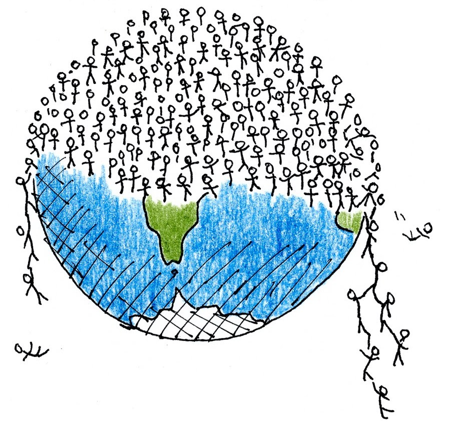

```{r setup, include=FALSE}
knitr::opts_chunk$set(echo = TRUE)
```



## Motivation

Never before in history, have there been so many people on Earth as right now. The number boosted in the years, from around 1 billion in the year 1800, to 7.5 billions in 2017.<br />

Estimates of the population amount at earlier times have been done too: at the time agriculture emerged in around 10000 Before Christ, estimates of the world population ranged between 1 million and 15 million. Even earlier - about 70000 years ago - studies supports that humans may have gone through bottleneck of 1000 - 10000 people according to the thory of the Toba supervulcanic eruption.

Given the population growth of the last century, what should we expect for the next one? Will this lead to major changes in our lifestyle, or will this lead to wars, poverty problems, lack of primary resources and so on?<br />
Or maybe all those are just unwarrant fears and everything is going to fix itself?


```{r, echo=FALSE, message=FALSE}
library(plotly)
library(readODS)
early_years <- read.ods("Datasets/before.ods")
early_years <- data.frame(early_years)
early_years <- early_years[2:nrow(early_years),]
early_years[,1] <- as.integer(early_years[,1])
early_years[,2] <- as.integer(early_years[,2])
early_years[,3] <- as.integer(early_years[,3])
 
p <- plot_ly(early_years, x = ~A, y = ~B, name = 'Lower Estimate', type = 'scatter', mode = 'lines+markers') %>%
  add_trace(y = ~C, name = 'Upper Estimate', mode = 'lines+markers') %>%
  layout(title = "Population Estimation of Early Ages (200 D.C - 1800 D.C)",
         xaxis = list(title = "Year"),
         yaxis = list (title = "World Population (in millions)"))
p 
#
```


## Demographic Transition

What happens when a poor country starts to walks throught welfare and moves to an industrialized economic system?
The birth rate, which is usually high in a poor country, will no longer be compensated by the high death rate, and the population starts to grow. Then at a certain point, the fear about overpopulation starts to rise.< br\>
In 1929 the American demographer Warren Thompson developed the theory of the Demogrephic Transition[3], whereby happens a transition from high birth and death rates to lower birth and death rates.

This theory can involve four to five stages of transition of the trend of population growth.
Here's a summary of the five steps:

* **Stage One**: pre-Industrial Revolution, birth rates and death rates are both high; in general the level of the population stays the same;
* **Stage Two**: in a developing country death rates tents to diminish while birth rates stay high: population is growing;
* **Stage Three**: thanks to the bettet economic and living conditions, births starts to decrease (a big point here is due to introduction of contraception)
* **Stage Four**: birth rates and death rates are both low, so population is stabilizing. Most of today's developed countries are in this stage;
* **Stage Five** (possible stage): here the birth rates have fallen below death rates, so the quantity of older people is bigger than the quantity of younger ones.


```{r, echo=FALSE, message=FALSE}
library(tidyr)
library(dplyr)
#setwd('/home/nicole/Data Science/exam_big_data')
birth_rate <- read.csv("Datasets/birth_rate.csv", skip=4)
death_rate <- read.csv("Datasets/death_rate.csv", skip=4)
tot_pop <- read.csv("Datasets/total_population.csv", skip=4)

dem_trans <- function(place) {
  birth_rate <- birth_rate %>%
    filter(Country.Name==place)
  death_rate <- death_rate %>%
    filter(Country.Name==place)
  tot_pop <- tot_pop %>%
    filter(Country.Name==place)
  
  colnames(birth_rate) <- c("Country", "Country.Code", "Indicator.Name", "Indicator.Code", substring(colnames(birth_rate[,6:length(birth_rate)-1]), 2), "X")
  colnames(death_rate) <- c("Country", "Country.Code", "Indicator.Name", "Indicator.Code", substring(colnames(death_rate[,6:length(death_rate)-1]), 2), "X")
  colnames(tot_pop) <- c("Country", "Country.Code", "Indicator.Name", "Indicator.Code", substring(colnames(tot_pop[,6:length(tot_pop)-1]), 2), "X")
  birth_rate[1:4] <- NULL; death_rate[1:4] <- NULL; tot_pop[1:4] <- NULL

  birth <- gather(birth_rate, key="year", "births", 1:ncol(birth_rate))
  death <- gather(death_rate, key="year", "deaths", 1:ncol(death_rate))
  pop <- gather(tot_pop, key="year", "quantity", 1:ncol(tot_pop))
  birth <- birth[-c(58,59),]
  death <- death[-c(58,59),]
  pop <- pop[-c(58,59),]
  #pop$quantity <- pop$quantity/10000000
  tmp <- left_join(birth, death, by="year")
  return(left_join(tmp, pop, by="year"))
}
place <- "Italy"
full <- dem_trans(place)

p1 <- plot_ly(full, x = ~year, y = ~births, name = 'Births', type = 'scatter', mode = 'lines+markers',width = 1000, height = 320) %>%
  add_trace(y = ~deaths, name = 'Deaths', mode = 'lines+markers') %>%
  layout(title = "Demoghraphic Transition",
         xaxis = list(title = "Year"),
         yaxis = list (title = paste("Deaths/Births (per 1000 people) in ",place)))

p2 <- plot_ly(full, x = ~year, y = ~quantity, name = 'Population', type = 'scatter', mode = 'lines+markers',width = 1000, height = 320) %>%
  layout(title = "Demoghraphic Transition",
         xaxis = list(title = "Year"),
         yaxis = list (title = paste("Total population of ",place)))
p <- subplot(p1, p2, shareX = TRUE, titleX = TRUE, titleY = TRUE, margin = c(0.02,0.02,1,1))
p

```

< br />
Italy is currently in Stage 4 of the Demographic Transition Model: as we can see from the above graphics, we are having low birth rates and low death rates; moreover the Population Growth Rate (PGR) is low, causing the stabilization of the people amount.

$$
PGR = \frac{P(t_2) - P(t_1)}{P(t_1)(t_2 - t_1)}
$$

A positive outcome of the PGR indicates that the population is increasing, while a negative one indicates the decreasing of it. Moreover, a zero result means that the quantity has not changed in the selected amount of time.<br />
Let's compute it on the data used above here, using as time interval the years.

## The Dataset

For this study I joined various dataset. I started from the dataset "Countries of the world" that you can find on Kaggle at https://www.kaggle.com/fernandol/countries-of-the-world, which contains free Data from the World Factbook; quoting the website: "The World Factbook is in the public domain and may be used freely by anyone at anytime without seeking permission."    
I decided to move forward my analysis combining to it some addittive datasets I found on the World Bank Open Data at https://data.worldbank.org/, because I wanted to focus my study on the overall health of different Countries.

The starting dataset consists of a series of variables describing different aspects of various countries all over the world: for every Country you can know the amount of population, the birthrate, the deathrate (over 1000 people), the GDP (Gross domestic product) measure of the State and so on.


**World Population**

I downloaded a dataset containing the total population of the world, divided by Countries. These data range from 1960 to 2017, so first of all I checked the change of the distribution of the population over the Continents and the States, and the percentage of growth in the various areas on different years, by means of dplyr and the rworldmap package.

We can see that in 1960 the total world population amounted to about 3.0321 billions, while in 2017 around 7.5303.

{ width=45% } { width=45% }

In the table below you can find the percentage of growth for every year, computed as:
$$
\frac{P_{t}-P{t_0}}{P_{t}} \cdot 100
$$
Where $P_{t}$ represents the population in a certain year and $P_{t_0}$ the population at the preceeding year.


```{r, echo=FALSE}
#{ width=70% }
```


Obviously the numbers contained in the dataset are not precise, there are some missing values around, so we can think of them like an estimation (or better an underestimation) of the World population in different regions.

With the image above we can have a sight at the distribution of the people around the Continents and the different Regions.

{ width=65% }


```{r, echo=FALSE, message=FALSE}
library(leaflet)
library(dplyr)
library(rgdal)
library(geojsonio)
setwd('/home/nicole/Data Science/exam_big_data/Clean')
density <- read.csv("density_clean_with_NAs.csv")
population <- density


colnames(population)[2] <- "name"
{
levels(population$name) <- c(levels(population$name), "United States of America")
population$name[population$name == 'United States'] <- "United States of America"

levels(population$name) <- c(levels(population$name), "Russia")
population$name[population$name == 'Russian Federation'] <- "Russia"

levels(population$name) <- c(levels(population$name), "Democratic Republic of the Congo")
population$name[population$name == "Congo, Dem. Rep."] <- "Democratic Republic of the Congo"

levels(population$name) <- c(levels(population$name), "Iran")
population$name[population$name == "Iran, Islamic Rep."] <- "Iran"

levels(population$name) <- c(levels(population$name), "Republic of Serbia")
population$name[population$name == "Serbia"] <- "Republic of Serbia"

levels(population$name) <- c(levels(population$name), "Egypt")
population$name[population$name == "Egypt, Arab Rep."] <- "Egypt"

levels(population$name) <- c(levels(population$name), "Venezuela")
population$name[population$name == 'Venezuela, RB'] <- "Venezuela"

levels(population$name) <- c(levels(population$name), "United Republic of Tanzania")
population$name[population$name == "Tanzania"] <- "United Republic of Tanzania"

levels(population$name) <- c(levels(population$name), "Yemen")
population$name[population$name == 'Yemen, Rep.'] <- "Yemen"

levels(population$name) <- c(levels(population$name), "Ivory Coast")
population$name[population$name == "Cote d'Ivoire"] <- "Ivory Coast"

levels(population$name) <- c(levels(population$name), "Kyrgyzstan")
population$name[population$name == "Kyrgyz Republic"] <- "Kyrgyzstan"

levels(population$name) <- c(levels(population$name), "Syria")
population$name[population$name == "Syrian Arab Republic"] <- "Syria"

levels(population$name) <- c(levels(population$name), "Republic of the Congo")
population$name[population$name == "Congo, Rep."] <- "Republic of the Congo"

levels(population$name) <- c(levels(population$name), "Laos")
population$name[population$name == "Lao PDR"] <- "Laos"

levels(population$name) <- c(levels(population$name), "Slovakia")
population$name[population$name == "Slovak Republic"] <- "Slovakia"

levels(population$name) <- c(levels(population$name), "Macedonia")
population$name[population$name == "Macedonia, FYR"] <- "Macedonia"

levels(population$name) <- c(levels(population$name), "Guinea Bissau")
population$name[population$name == "Guinea-Bissau"] <- "Guinea Bissau"

levels(population$name) <- c(levels(population$name), "South Korea")
population$name[population$name == "Korea, Rep."] <- "South Korea"

levels(population$name) <- c(levels(population$name), "North Korea")
population$name[population$name == "Korea, Dem. People’s Rep."] <- "North Korea"
}

setwd('/home/nicole/Data Science/exam_big_data')
states <- geojsonio::geojson_read("prova.geo.json", what = "sp")

prova <- merge(states, population, by="name")

m <- leaflet(prova) %>%
  setView(-1, 42, zoom=2) %>%
  addProviderTiles("MapBox", options = providerTileOptions(
    id = "mapbox.light",
    accessToken = Sys.getenv('MAPBOX_ACCESS_TOKEN')))


bins <- c(0, 10, 20, 50, 100, 200, 500, 1000, Inf)
pal <- colorBin("YlOrRd", domain = states$density, bins = bins)


labels <- sprintf(
  "<strong>%s</strong><br/>%g people / kdm<sup>2</sup>",
  prova$name, prova$Density2017
) %>% lapply(htmltools::HTML)


m <- m %>% addPolygons(
  fillColor = ~pal(Density2017),
  weight = 2,
  opacity = 1,
  color = "white",
  dashArray = "3",
  fillOpacity = 0.7,
  highlight = highlightOptions(
    weight = 5,
    color = "#666",
    dashArray = "",
    fillOpacity = 0.7,
    bringToFront = TRUE),
  label = labels,
  labelOptions = labelOptions(
    style = list("font-weight" = "normal", padding = "3px 8px"),
    textsize = "15px",
    direction = "auto"))
m
#<<insertHTML:[map.html]
```


**Gross domestic product**

The GDP is defined as "an aggregate measure of production equal to the sum of the gross values added of all resident and institutional units engaged in production (plus any taxes, and minus any subsidies, on products not included in the value of their outputs).” And is considered the **"world's most powerful statistical indicator of national development and progress"**.

The dataset I used contained the percentage of the GDP annual growth for every country.

## What are the Prospects?


## References and Used data

[1] https://data.worldbank.org/< br\>
[2] http://www.ecology.com/population-estimates-year-2050/ (early ages)< br\>
[3] https://en.wikipedia.org/wiki/Demographic_transition#History_of_the_theory< br\>
